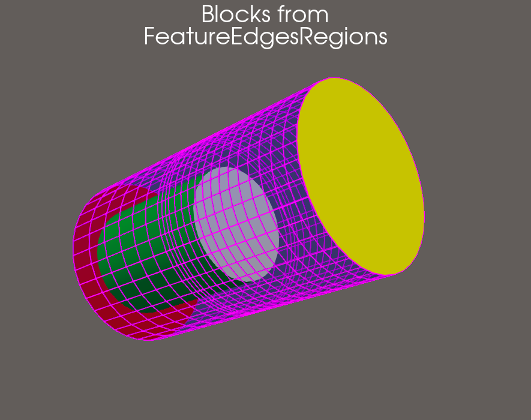

## Introduce vtkExplodeDataSet filter

vtkExplodeDataSet creates a vtkPartitionedDataSetCollection from any input dataset according to a cell scalar isovalue criteria.
Each partition of the output contains cells that share the same value for the given cell array.

It is similar to a vtkMultiThreshold, configured to extract every single
value of the input array.

It comes in replacement of vtkSplitByCellScalarFilter to use
vtkPartitionedDataSetCollection instead of vtkMultiBlockDataSet as output.
Also it relies on the threaded vtkExtractCells filter.

This is useful to create composite data from structured array.
Examples of usage include:
  * splitting mesh from materials (as with OBJ groups)
  * creating blocks from Connectivity array or (FeatureEdges)RegionIds

> 
>
> Using vtkExplodeDataSet after a vtkGenerateRegionIds
