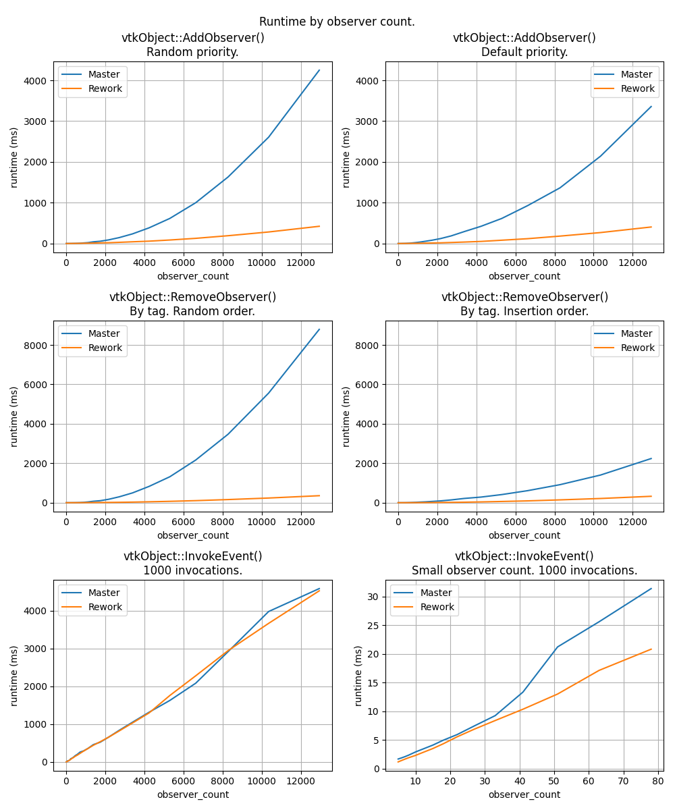

## Performance: Faster observer operations in `vtkObject`.

`vtkObject` now stores observers in a `std::map` (replacing the custom linked list). This improves the runtime cost of
`AddObserver`, `RemoveObserver`, and `InvokeEvent`, especially for objects with many observers.

* Previous behavior: `AddObserver` and `RemoveObserver` scanned the entire linked list, i.e. `O(n)` runtime per
  operation.

* New behavior: `AddObserver` and `RemoveObserver` both use a binary search via `std::map`, i.e. `O(log n)` runtime per
  operation in all cases.

Some notes on interpreting the microbenchmark results:

* The previous `RemoveObserver` implementation short-circuits once the observer is found, so the best-case scenario is
  to remove observers in insertion order. Even in that best case, the new implementation provides significant speedup.

* Both implementations of `InvokeEvent` are `O(n)` runtime (because all relevant observers must be invoked) but the
  new implementation has better performance for small numbers of observers due to improved memory layout and cache
  behavior.

The microbenchmark source code is available at https://gitlab.kitware.com/david.allemang/vtk-benchmarking.
